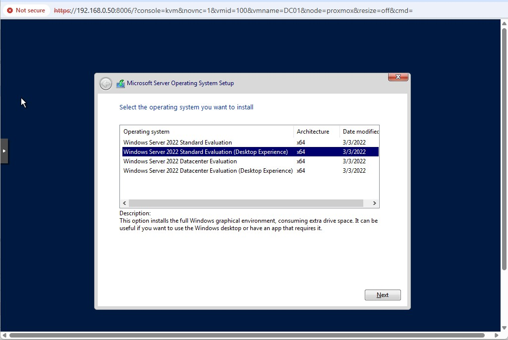
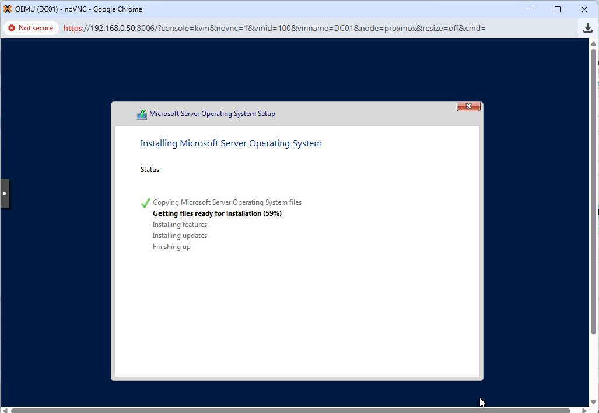
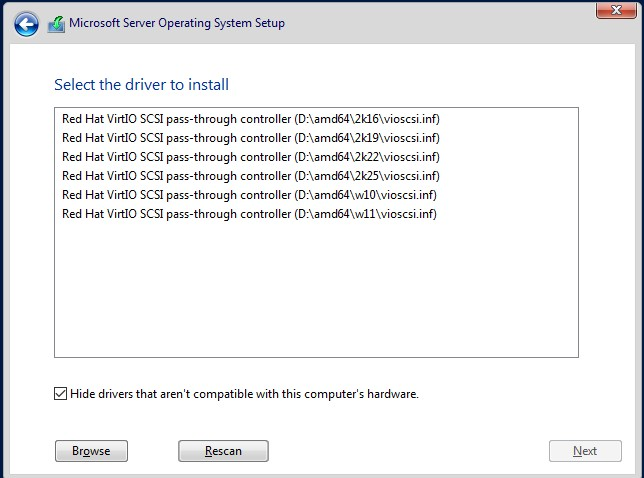

# Windows Server Installation

## Objective

Install Windows Server 2022 on a Proxmox virtual machine to serve as the foundation for an Active Directory lab environment.

---

## Environment

* Hypervisor: Proxmox VE
* VM Name: dc01
* Disk: 40GB (VirtIO SCSI)
* CPU: 2 cores
* Memory: 4GB

---

## Installation Steps

1. Started the virtual machine in Proxmox.
2. Opened the console to access the VM display.
3. Booted from the Windows Server 2022 ISO.
4. Selected **Windows Server 2022 Standard (Desktop Experience)**.
5. Proceeded through the installation wizard.

---

## Issue Encountered

No disk was visible during the Windows installation.

---

## Cause

The VM was configured with a VirtIO SCSI controller, but the Windows installer does not include the required VirtIO storage drivers by default.

---

## Resolution

1. Downloaded the VirtIO driver ISO from the official Fedora/Red Hat repository.
2. Attached the ISO to the VM as a virtual CD/DVD drive.
3. Selected **Load Driver** in the Windows installer.
4. Navigated to: Selected Windows 11 version
5. Loaded the VirtIO SCSI driver.

---

## Result

* The virtual disk was detected successfully.
* Windows Server installation proceeded without further issues.
* Operating system installed successfully.

---

## Notes

Using VirtIO drivers provides better performance compared to legacy disk controllers such as IDE. This reflects modern virtualised infrastructure practices.

---

## Screenshots

