# Active Directory Domain Controller Setup (Proxmox Lab)

## Overview

This lab documents the deployment of a Windows Server 2022 Domain Controller within a Proxmox virtualised environment. It includes driver installation, network configuration, Active Directory setup, and DNS configuration.

This forms the foundation of an enterprise-style Windows domain environment.

---

# Environment

* Hypervisor: Proxmox VE
* VM OS: Windows Server 2022
* Server Name: DC01
* Domain: lab.local
* Network: 192.168.0.0/24

---

# 1. VirtIO Driver Installation

## Purpose

Windows Server does not include native drivers for Proxmox virtual hardware. VirtIO drivers are required for:

* Network connectivity
* Disk performance
* Memory optimisation

## Steps

* Mounted `virtio-win.iso` in Proxmox
* Opened ISO inside the VM
* Ran:

  ```
  virtio-win-guest-tools.exe
  ```
* Installed all default drivers

## Outcome

* Network adapter successfully detected
* VM performance improved
* System ready for configuration

## Screenshots

*ISO Mounted as CD/DVD
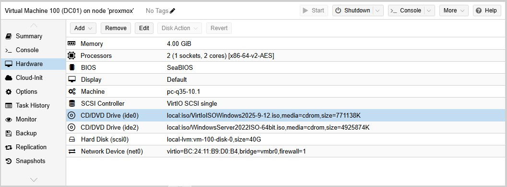

*ISO contents on drive
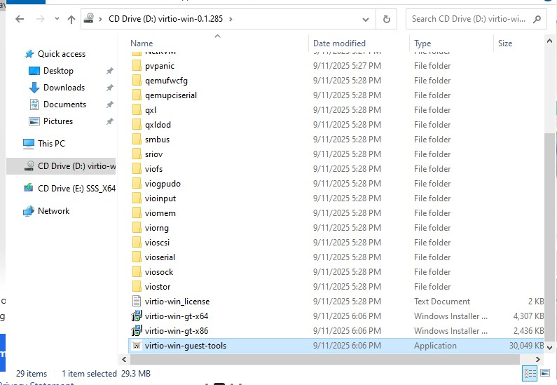

*Confirmed VirtIO network adapter
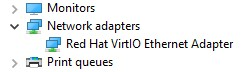

---

# 2. Network Configuration

## Purpose

Active Directory requires a stable network configuration with a static IP.

## Configuration

* IP Address: 192.168.0.10
* Subnet: 255.255.255.0 (/24)
* Gateway: 192.168.0.1
* DNS (initial): 192.168.0.1 (temporary)

## Steps

* Identified network adapter:

  ```
  Get-NetAdapter
  ```
* Assigned static IP:

  ```
  New-NetIPAddress -InterfaceAlias "Ethernet" `
  -IPAddress 192.168.0.10 -PrefixLength 24 -DefaultGateway 192.168.0.1
  ```
* Configured DNS temporarily to router for internet access

## Outcome

* Stable network configuration established
* Internet connectivity confirmed prior to domain setup

## Screenshots

* `Get-NetAdapter`
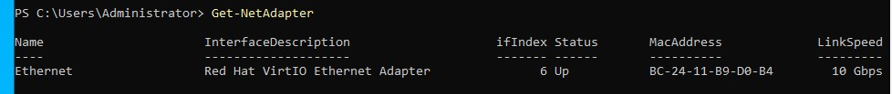

* Static IP configuration
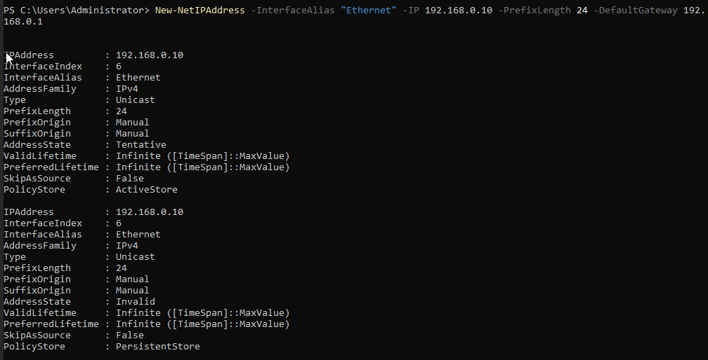
  
* `ipconfig`
* Successful ping to gateway
* Successful `nslookup google.com`
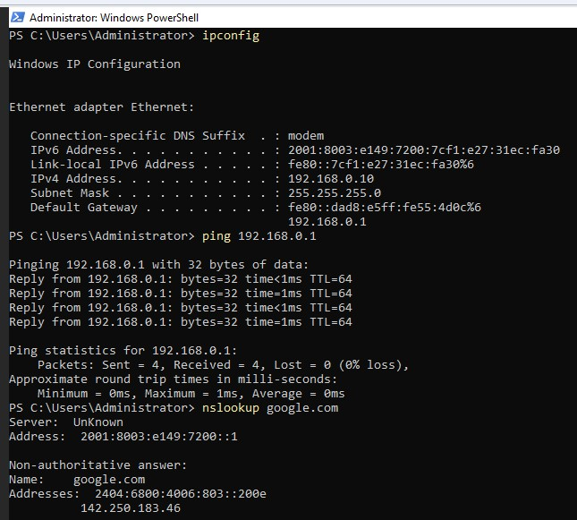

---

# 3. Server Renaming

## Purpose

Apply consistent naming aligned with server roles.

## Step

```
Rename-Computer -NewName DC01 -Restart
```

## Outcome

* Server renamed to DC01
* System rebooted successfully

## Screenshots

* Rename command

  
* `hostname` output after reboot
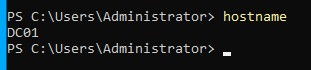

---

# 4. Network Validation

## Purpose

Verify system stability after reboot and configuration changes.

## Steps

```
ipconfig
ping 192.168.0.1
nslookup google.com
```

## Outcome

* Network connectivity confirmed
* DNS resolution verified using gateway

## Screenshots

* `ipconfig`
* Ping success
* `nslookup` success


---

# 5. Active Directory Domain Services Installation

## Purpose

Install the required role for domain services.

## Step

```
Install-WindowsFeature AD-Domain-Services -IncludeManagementTools
```

## Outcome

* AD DS role installed successfully
* Server ready for promotion

## Screenshots

* Installation command
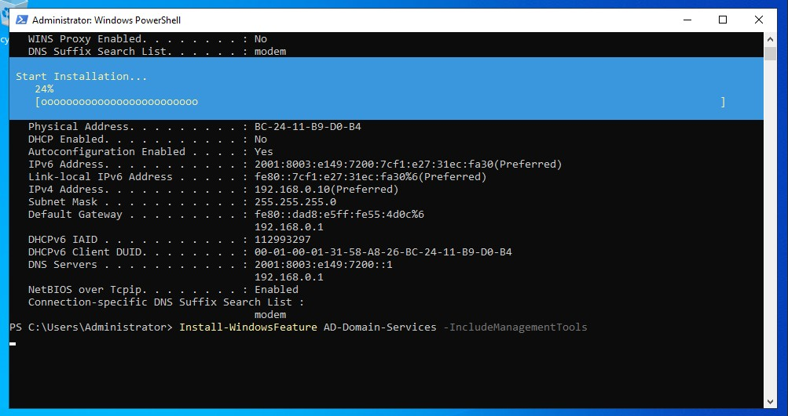

* Success output
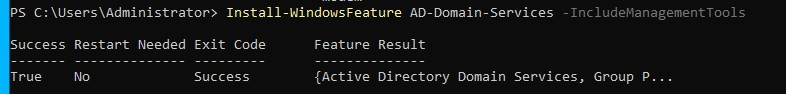

---

# 6. Domain Controller Promotion

## Purpose

Create a new Active Directory forest and promote the server to a Domain Controller.

## Command

```
Install-ADDSForest `
-DomainName "lab.local" `
-DomainNetbiosName "LAB" `
-InstallDNS `
-SafeModeAdministratorPassword (ConvertTo-SecureString "Password123!" -AsPlainText -Force) `
-Force
```

## Explanation

* Creates a new AD forest (`lab.local`)
* Sets NetBIOS name (`LAB`)
* Installs and configures DNS
* Promotes server to Domain Controller
* Sets Directory Services Restore Mode password

## Outcome

* Domain Controller created
* DNS installed and integrated
* Server rebooted into domain environment

## Screenshots

* Promotion command
* Installation progress
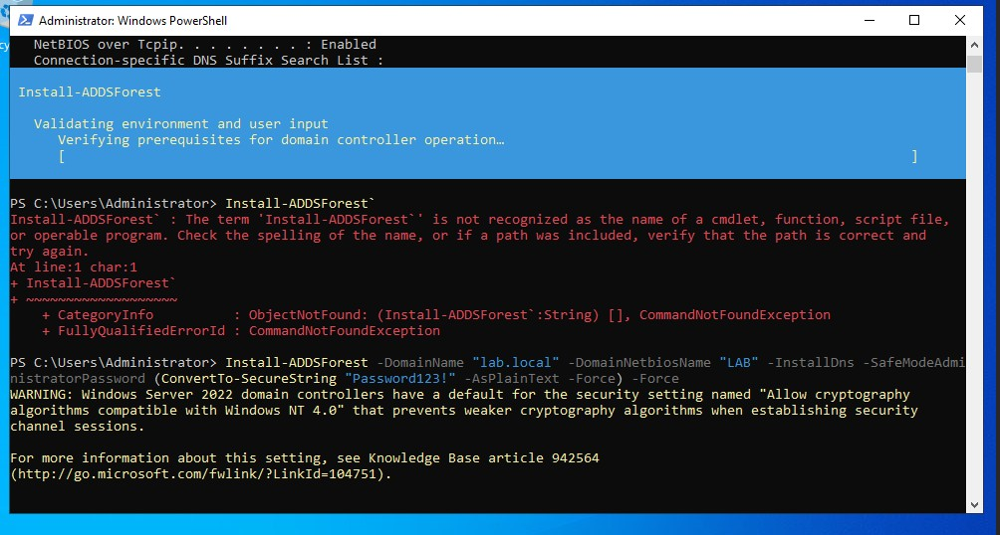

* Login screen showing `LAB\Administrator`
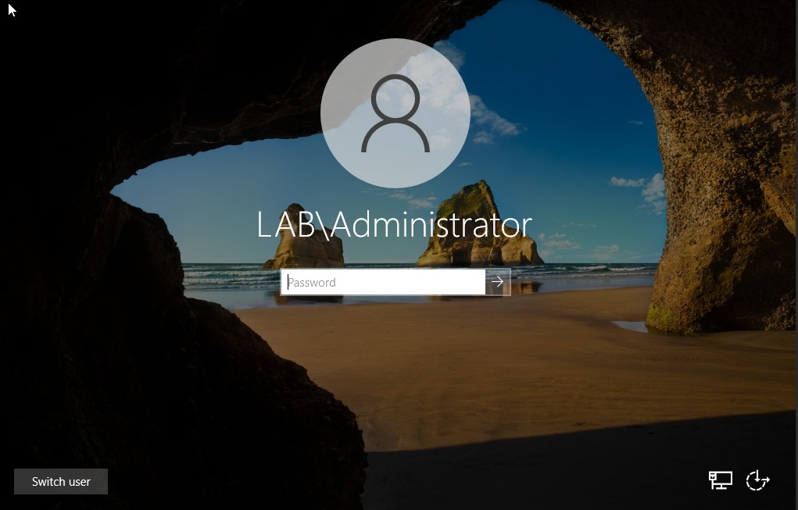

---

# 7. Domain Verification

## Steps

```
whoami
hostname
```

## Outcome

* Confirmed domain context (`lab\administrator`)
* Confirmed server identity (`DC01`)

## Screenshots

* `whoami`
* `hostname`
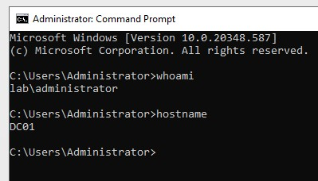

---

# 8. DNS Reconfiguration (Critical Step)

## Purpose

Ensure the Domain Controller uses itself for DNS resolution.

## Step

```
Set-DnsClientServerAddress -InterfaceAlias "Ethernet" `
-ServerAddresses 192.168.0.10
```

## Outcome

* DNS now points to Domain Controller
* Required for Active Directory functionality

## Screenshots

* Command execution
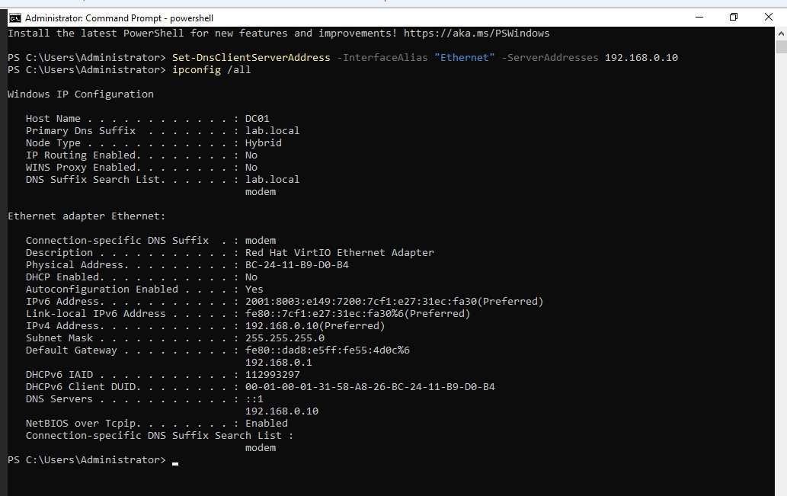

---

# 9. DNS Forwarders Configuration

## Purpose

Enable efficient external DNS resolution.

## Step

```
Add-DnsServerForwarder -IPAddress 1.1.1.1,8.8.8.8
```

## Outcome

* External queries forwarded to public DNS servers
* Improved performance and reliability, rather than relying on root hints

---

# 10. DNS Validation

## Step

```
nslookup google.com
```

## Outcome

* Queries resolved successfully
* DNS server identified as DC01

---

# Key Concepts Learned

* Active Directory relies heavily on DNS
* Domain Controllers must use themselves for DNS
* DNS resolution can occur via root hints or forwarders
* Forwarders improve performance and align with enterprise practices
* IPv6 is enabled by default but should not interfere with DNS configuration
* Network validation is critical after configuration changes

---

# Summary

This lab successfully deployed a fully functional Active Directory Domain Controller in a Proxmox environment. The server was configured with a static IP, promoted to a Domain Controller, and configured with proper DNS settings, including forwarders for external resolution.

---

# Next Steps

* Create Windows client VM (CLIENT01)
* Join client to domain
* Create users, groups, and OUs
* Configure shared folders and permissions
* Apply Group Policy
