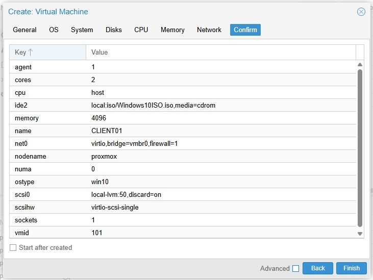

# Client VM Build and Initial Configuration (CLIENT01)

## Overview

This document covers the creation and initial setup of a Windows client virtual machine (`CLIENT01`) in Proxmox. It includes VM configuration choices, Windows installation, VirtIO driver loading, post-install driver installation, and initial connectivity verification.

This client machine is intended to be joined to the Active Directory domain in the next phase of the lab.

---

# Environment

* Hypervisor: Proxmox VE
* Client VM Name: CLIENT01
* Operating System: Windows 10/11 Pro
* Intended Domain: `lab.local`

---

# 1. VM Creation in Proxmox

## Purpose

Create a Windows client VM that can communicate with the Domain Controller and be used for domain join, user logon, and workstation administration testing.

## Configuration

### System

* Machine type: `i440fx`
* BIOS: `SeaBIOS`
* SCSI Controller: `VirtIO SCSI single`

### Disk

* Bus/Device: `SCSI`
* Storage: `local-lvm`
* Disk Size: 50 GB
* Discard: Enabled
* IO Thread: Disabled

### CPU

* Sockets: 1
* Cores: 2
* Type: `host`

### Memory

* RAM: 4096 MB
* Ballooning: Enabled

### Network

* Bridge: `vmbr0`
* Model: `VirtIO (paravirtualized)`

## Notes

The VM was configured to use VirtIO-based storage and networking to improve performance and align with Proxmox best practices.

## Screenshots

* VM creation summary


---

# 2. Windows Installation

## Purpose

Install a Windows client operating system suitable for joining an Active Directory domain.

## Version Selected

* Windows 10 Pro / Windows 11 Pro

## Notes

The Pro edition was selected because Home editions do not support domain join.

During installation, no product key was entered. This is acceptable for a lab environment and does not affect domain functionality.

## Screenshots

* Windows setup start screen
* Edition selection screen
* Product key screen

---

# 3. VirtIO Storage Driver Load During Install

## Purpose

Allow Windows Setup to detect the virtual disk presented through the VirtIO SCSI controller.

## Issue Encountered

At the disk selection stage, Windows Setup displayed no available disks. This occurred because the VirtIO SCSI storage driver is not included natively in the Windows installer.

## Resolution

The VirtIO storage driver was loaded manually from the VirtIO ISO.

## Driver Path

```plaintext
virtio-win.iso → vioscsi → w10 → amd64
```

## Driver Selected

* Red Hat VirtIO SCSI controller

## Outcome

After loading the correct driver, the virtual disk appeared and Windows installation proceeded normally.

## Screenshots

* "No drives found" screen
* Driver load window
* Driver selection showing Red Hat VirtIO SCSI controller
* Disk appearing after driver load

---

# 4. Windows Setup Without Internet

## Purpose

Complete the initial Windows setup despite no network being available during the installer stage.

## Notes

Because the VM used a VirtIO network adapter, Windows Setup did not initially detect a network connection. This was expected because the VirtIO network driver was not yet installed.

The setup was continued using:

* `I don't have internet`
* `Continue with limited setup`

## Outcome

Windows installation and first-time setup completed successfully.

## Screenshots

* No internet prompt during setup
* Continue with limited setup prompt

---

# 5. VirtIO Guest Tools Installation

## Purpose

Install the required Proxmox/Red Hat VirtIO drivers after Windows setup.

## Method

The VirtIO ISO was mounted and the bundled installer was run:

```plaintext
virtio-win-guest-tools.exe
```

## What This Installed

* VirtIO network driver
* VirtIO storage drivers
* Balloon driver
* QEMU guest agent

## Outcome

After installation and reboot, the client VM had a working network adapter and full VirtIO driver support.

## Screenshots

* VirtIO ISO mounted in Proxmox
* Installer running
* Installer completion screen

---

# 6. Driver Verification

## Purpose

Confirm that the correct VirtIO drivers were installed successfully.

## Verification Methods

### Network Adapter Check

```powershell
Get-NetAdapter
```

### Expected Result

* Red Hat VirtIO Ethernet Adapter

## Notes

This confirmed that the client VM was using the correct VirtIO network driver rather than a fallback emulated adapter.

## Screenshots

* `Get-NetAdapter` output showing Red Hat VirtIO Ethernet Adapter

---

# 7. Initial Connectivity Verification

## Purpose

Confirm the client VM had working network connectivity after driver installation.

## Checks Performed

### IP Configuration

```powershell
ipconfig
```

### Internet Reachability

```powershell
ping 8.8.8.8
ping google.com
```

## Domain Controller Reachability
```powershell
ping 192.168.0.10
```

## Outcome

* Valid network connectivity confirmed
* DNS resolution confirmed
* Internet access confirmed
* Domain controller reachability confirmed

## Screenshots

* `ipconfig`
* Successful ping to `8.8.8.8`
* Successful ping to `google.com`

---

# Key Concepts Learned

* Proxmox VirtIO devices often require manual driver support during Windows installation
* A VirtIO SCSI disk requires the matching storage driver before Windows can detect it
* VirtIO network adapters may not be recognised during initial Windows setup
* The bundled guest tools installer provides a clean method for installing all required VirtIO drivers

---

# Summary

This phase established a fully functional Windows client VM in Proxmox, configured with VirtIO storage and networking. Windows was installed successfully, the required drivers were loaded and verified, and network connectivity was confirmed.

The client machine is now ready for:

* DNS configuration pointing to the Domain Controller
* Domain join to `lab.local`

---

# Next Steps

* Set DNS to DC01
* Verify communication with the Domain Controller
* Join CLIENT01 to the domain
* Test domain logon
