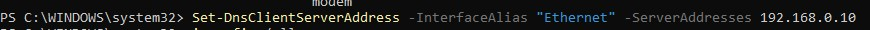
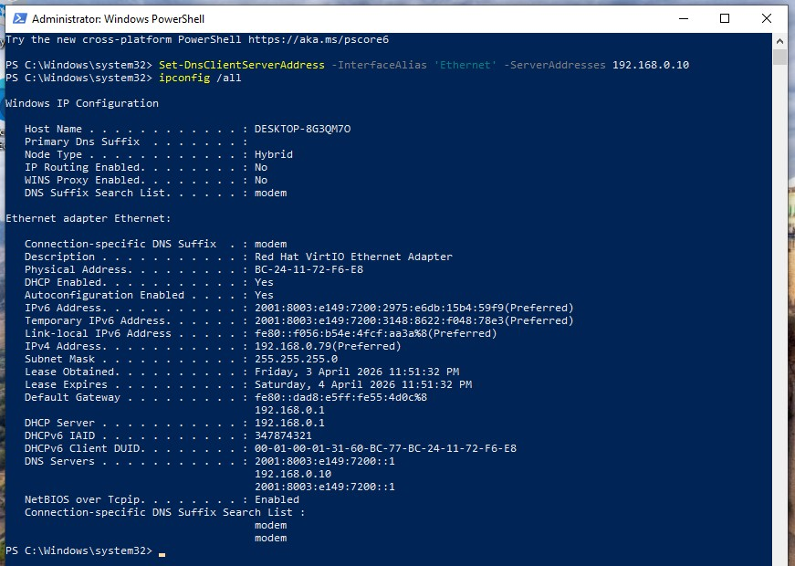
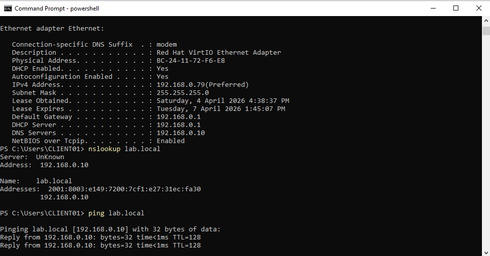
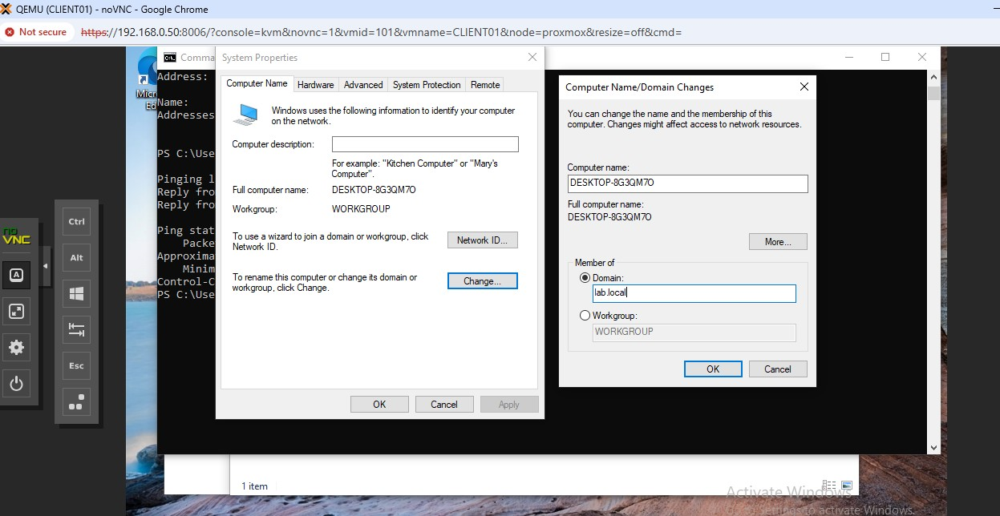
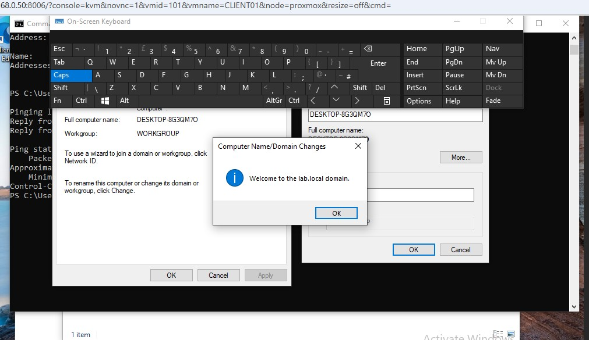

# Client Domain Join (CLIENT01)

## Overview

This phase covers configuring the client machine to communicate with the Domain Controller and successfully joining it to the Active Directory domain.

This included resolving a DNS issue, verifying connectivity, and completing the domain join process.

---

# Environment

* Client Machine: CLIENT01
* Domain: lab.local
* Domain Controller: DC01 (192.168.0.10)

---

# 1. DNS Configuration

## Purpose

Ensure the client uses the Domain Controller for DNS so it can locate Active Directory services.

## Configuration

* DNS Server: 192.168.0.10

## Method (PowerShell)

```powershell
Set-DnsClientServerAddress -InterfaceAlias "Ethernet" -ServerAddresses 192.168.0.10
```

## Verification

```powershell
ipconfig /all
```

## Expected Output

```plaintext
DNS Servers . . . . . : 192.168.0.10
```

## Screenshots

* PowerShell command Set-DnsClientServerAddress sets the DNS server


---

# 2. DNS Resolution Issue (IPv6 Priority)

## Issue

The client was unable to resolve `lab.local` despite correct IPv4 DNS configuration.

## Symptoms

* IPv6 DNS server listed before IPv4 DNS under ipconfig /all


## Root Cause

The system prioritised an IPv6 DNS server provided by the router/ISP, which did not contain Active Directory DNS records.

## Resolution

IPv6 was disabled on the client network adapter to ensure DNS queries were sent to the Domain Controller.

## Outcome

DNS resolution worked immediately after disabling IPv6.

## Verification

```powershell
nslookup lab.local
```

## Screenshots

* nslookup  and ping success
* IPv4 is now only visible in ipconfig



---

# 4. Domain Join Process

## Steps

1. Open System Properties:

   ```
   sysdm.cpl
   ```
2. Navigate to:

   * Computer Name tab
   * Click "Change"
3. Select:

   * Domain
4. Enter:

   ```
   lab.local
   ```
5. Authenticate using:

   ```
   LAB\Administrator
   ```

## Outcome

The client machine successfully joined the domain.

## Screenshots

* Domain entry screen
* Credential prompt

* "Welcome to the lab.local domain" message
* 

---

# 5. Keyboard Mapping Issue (VM Console)

## Issue

Keyboard input in the Proxmox console did not behave correctly. Shift and Caps Lock produced unexpected results, making it difficult to enter credentials.

## Cause

Keyboard mapping mismatch between host system and VM console.

## Resolution

Used the Windows On-Screen Keyboard within the VM to input credentials accurately.

## Outcome

Credentials entered successfully and domain join completed.

---

# 6. Domain Login Verification

## Step

After reboot, logged into the domain using:

```plaintext
LAB\Administrator
```

## Outcome

Successful authentication against Active Directory confirmed.

## Screenshots

* Login screen showing domain
* Desktop after login

---

# Key Concepts Learned

* Active Directory relies on DNS for service discovery
* Clients must use the Domain Controller for DNS
* IPv6 DNS can override IPv4 and cause domain issues
* Domain join requires successful DNS resolution
* Virtual machine consoles may introduce keyboard input issues

---

# Summary

The client machine was successfully configured to use the Domain Controller for DNS, troubleshooting was performed to resolve IPv6 DNS conflicts, and the system was joined to the Active Directory domain.

This establishes a working domain environment with both server and client integration.

---

# Next Steps

* Create domain users and groups
* Organise Active Directory structure (OUs)
* Configure file shares and permissions
* Apply Group Policy
