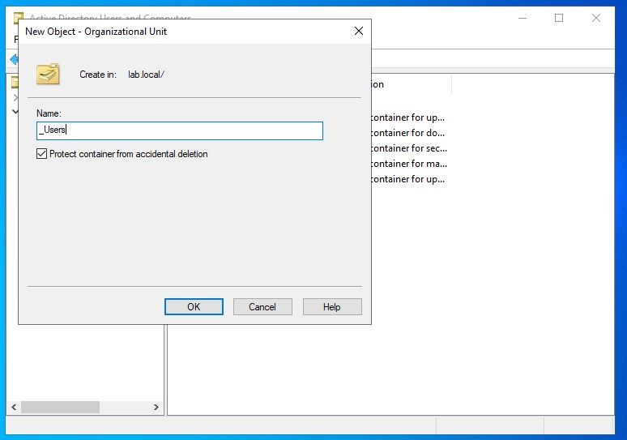
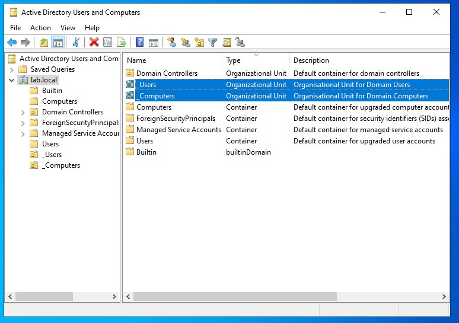
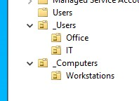
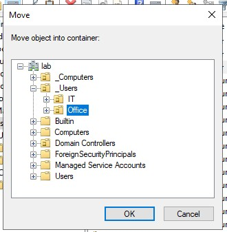
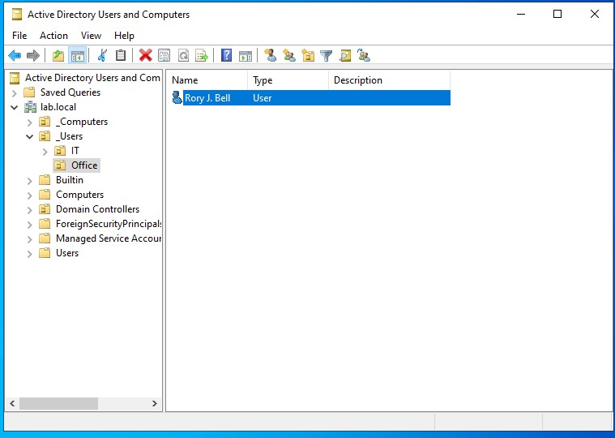
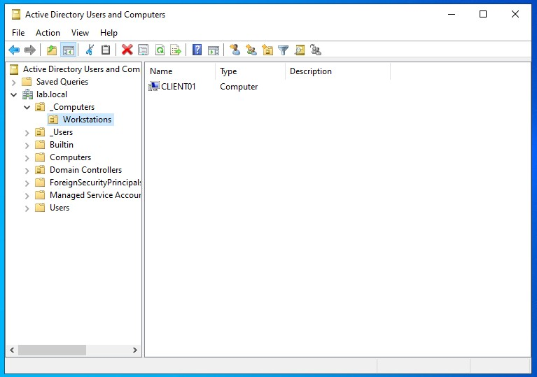

# Active Directory Organisational Units (OUs)

## Overview

This phase covers creating and structuring Organisational Units (OUs) within Active Directory to organise users and computers in a scalable and manageable way.

Default containers were replaced with a structured OU hierarchy to align with real-world best practices.

---

# Environment

* Domain: lab.local
* Domain Controller: DC01
* Client Machine: CLIENT01

---

# 1. Understanding OUs vs Containers

## Default Containers

Active Directory includes built-in containers such as:

* Users
* Computers
* Builtin

These are system-created and have limitations:

* Cannot apply Group Policy
* Not suitable for long-term organisation

---

## Organisational Units (OUs)

OUs are administrator-created containers used to:

* Organise users and computers
* Apply Group Policy
* Delegate administrative control

---

## Key Difference

| Feature                    | OU | Container |
| -------------------------- | -- | --------- |
| Custom structure           | ✅  | ❌         |
| Group Policy support       | ✅  | ❌         |
| Delegation support         | ✅  | ❌         |
| Intended for long-term use | ✅  | ❌         |

---

# 2. Creating Top-Level OUs

## Purpose

Create a structured layout for users and computers.

## Steps

1. Open Active Directory Users and Computers:

   ```
   dsa.msc
   ```

2. Right-click:

   ```
   lab.local → New → Organizational Unit
   ```

3. Create:

```plaintext id="top_ous"
_Users
_Computers
```

---

## Outcome

Top-level OUs were created to separate user and computer objects.

## Screenshots

* OU creation dialogue
  


* Top-level OU structure



---

# 3. Creating Sub-OUs

## Purpose

Further organise resources by role or function.

---

## Under `_Users`

Created:

```plaintext id="user_ous"
Office
IT
```

---

## Under `_Computers`

Created:

```plaintext id="comp_ous"
Workstations
```

---

## Resulting Structure

```plaintext id="final_structure"
lab.local
 ├── Users (default container)
 ├── Computers (default container)
 ├── _Users
 │    ├── Office
 │    ├── IT
 ├── _Computers
 │    ├── Workstations
```

---

## Screenshots

* Nested Organisational Units



---

# 4. Moving Objects into OUs

## Purpose

Place users and computers into the correct organisational structure.

---

## Moving User

User:

```plaintext id="user_move"
rbell
```

Moved from:

```
Users (default container)
```

To:

```
_Users → Office
```

---

## Moving Computer

Computer:

```plaintext id="comp_move"
CLIENT01
```

Moved from:

```
Computers (default container)
```

To:

```
_Computers → Workstations
```

---

## Outcome

Objects were successfully organised into appropriate OUs.

## Screenshots

* Move dialogue
  


* User inside OU
  


* Computer inside OU
  


---

# 5. Why OUs Matter

OUs are critical for:

* Applying Group Policy to specific groups of users or machines
* Organising environments logically (departments, roles, locations)
* Delegating administrative control

---

## Example Use Cases

* Apply password policies to users
* Restrict software on workstations
* Separate IT staff from general users

---

# 6. Key Concepts Learned

* Default containers are not suitable for structured environments
* OUs provide flexibility and control within a domain
* Objects should be moved into OUs for proper management
* Active Directory structure directly impacts policy and access control

---

# Summary

A structured OU hierarchy was created to replace default containers and organise users and computers logically. This provides a scalable foundation for applying policies and managing permissions in later stages.

---

# Next Steps

* Create security groups
* Assign users to groups
* Configure permissions using groups
* Apply Group Policy to OUs
